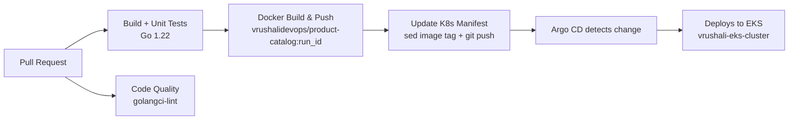

# Product Catalog Microservice — End-to-End CI/CD

A Go-based product catalog microservice with a complete, production-style delivery pipeline:
containerized with Docker, built/tested/linted and shipped by **GitHub Actions**, and deployed
to **AWS EKS** using the **GitOps** model — the pipeline's final act is a git commit updating the
Kubernetes manifest, which Argo CD continuously reconciles onto the cluster.

> Infrastructure lives in its own repo: [terraform-aws-eks-infrastructure](https://github.com/vrushali-dhage/terraform-aws-eks-infrastructure) — modular VPC + EKS with remote state on S3/DynamoDB.

## Pipeline Flow



## CI Stages (`.github/workflows/ci.yaml`)

| Job | What it does |
|---|---|
| `build` | Checkout → Go 1.22 setup → `go build` → unit tests |
| `code-quality` | golangci-lint static analysis (runs in parallel with build) |
| `docker` | Buildx setup → registry login via GitHub Secrets → build + push image tagged with the unique `github.run_id` |
| `updatek8s` | Rewrites the `image:` tag in `kubernetes/product-catalog/deploy.yaml` and commits it back — the GitOps handoff |

Credentials are never in the YAML: Docker Hub auth uses a Personal Access Token stored in
**GitHub Actions Secrets**; the manifest commit uses the built-in `GITHUB_TOKEN`.

## Repository Structure

```
├── .github/workflows/ci.yaml      # the pipeline
├── src/product-catalog/           # Go source + Dockerfile
└── kubernetes/product-catalog/    # Deployment & Service manifests (Argo CD watches these)
```

## Related Infrastructure

The target cluster (EKS v1.34, 2× managed nodes, private subnets, ALB ingress via the
AWS Load Balancer Controller) is provisioned entirely with Terraform — see the
[infrastructure repo](https://github.com/vrushali-dhage/terraform-aws-eks-infrastructure).

## Roadmap

- [x] CI pipeline (build, test, lint, image build/push, manifest update)
- [ ] Argo CD application — continuous deployment to EKS
- [ ] Image vulnerability scanning stage

## Attribution

Service source adapted from the [OpenTelemetry Demo](https://github.com/open-telemetry/opentelemetry-demo)
(Apache-2.0). Dockerfile, CI pipeline, Kubernetes manifests, and all infrastructure: my own work.
